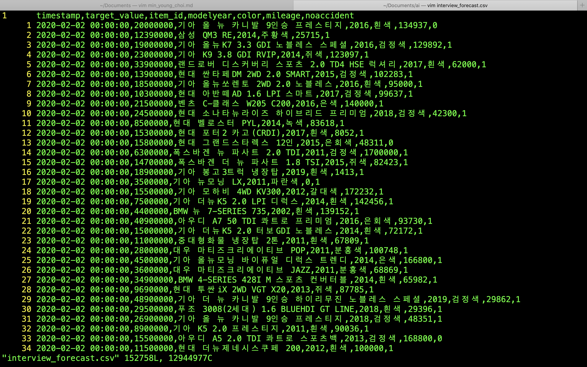

# Data Science Related Questions

If you have the following data set,

, how would you go about creating a price forecasting model for a particular car model?

* Please outline your process step by step.
* What kind of statistical or machine learning approach would you take first?
* How would you go about testing the effectiveness of your model?
* How would you go about deploying this model?
